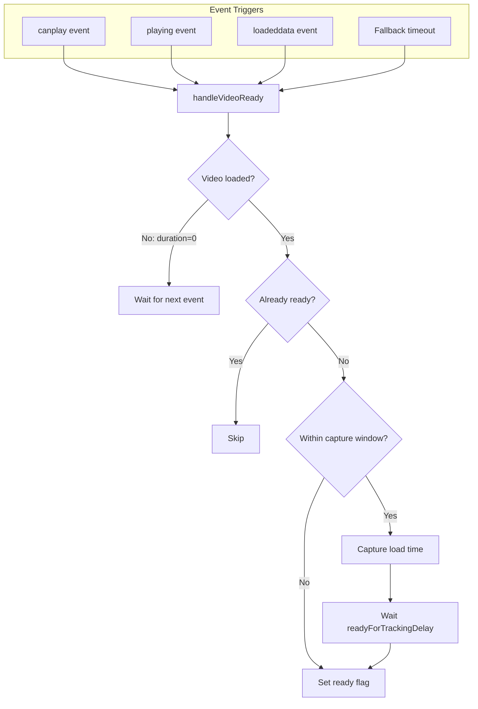

# Event-Based Ready Tracking Refactor

## Current Problems

1. **Nested timeouts**: `loadTimeCaptureTimeout` schedules `readyForTrackingTimeout` inside it
2. **Time window gate**: If `captureLoadTimeOnce()` is called after window closes, ready flag is never set
3. **No video validation**: Ready flag can be set even if video isn't actually loaded

## New Design

Replace nested timeouts with an **event-driven approach**:



### File: [features/restore-position/history.ts](apps/extension/src/features/restore-position/history.ts)

#### 0. Preserve existing flag resets at start of setupVideoTracking

**Critical:** Keep these lines at the start of `setupVideoTracking()`:

```typescript
video._streamKeysPlaybackStarted = false;
video._streamKeysReadyForTracking = false;
```

These reset the video element flags when tracking is re-initialized (e.g., after navigating to a new video). Without these, a reused video element (Disney+ pattern) would retain old flag values.

The `_streamKeysSeekListenerAdded` flag is reset separately in `index.ts` before calling `setupTracking()`.

#### 1. Add video readiness check

**Important:** Must use augmented methods, not native properties. Disney+ has unreliable native `video.duration` (buffer-relative). The `_streamKeysGetDuration()` method uses the Shadow DOM progress bar on Disney+, and falls back to `video.duration` for other services.

```typescript
/**
 * Check if video is actually loaded and ready for tracking.
 * Uses augmented duration getter to support services like Disney+
 * where native video.duration is unreliable (buffer-relative).
 */
const isVideoLoaded = (): boolean => {
  const duration = video._streamKeysGetDuration?.() ?? video.duration;
  return duration > 0 && !isNaN(duration);
};
```

Note: We don't check `readyState` because:

- Disney+ progress bar may be ready before `readyState` reflects it
- The duration check is sufficient - if we can get valid duration, video is loaded

#### 2. Replace `captureLoadTimeOnce` with unified `handleVideoReady`

```typescript
let readyScheduled = false;
let fallbackTimeout: number | null = null;
let captureDelayTimeout: number | null = null;  // Track nested timeout for capture
let readyDelayTimeout: number | null = null;     // Track nested timeout for ready flag

/**
 * Handle video becoming ready - capture load time if possible, then enable tracking.
 * Called by video events (canplay, playing, loadeddata) and fallback timeout.
 */
const handleVideoReady = () => {
  // Already fully ready - clear any pending fallback and exit
  if (video._streamKeysReadyForTracking) {
    if (fallbackTimeout !== null) {
      clearTimeout(fallbackTimeout);
      fallbackTimeout = null;
    }
    return;
  }
  
  // Already scheduled to become ready - fallback was cleared when scheduled
  if (readyScheduled) return;
  
  // Check video is actually loaded (uses augmented duration for Disney+ compatibility)
  if (!isVideoLoaded()) return;
  
  // Mark as scheduled and clear fallback - we're taking over
  readyScheduled = true;
  if (fallbackTimeout !== null) {
    clearTimeout(fallbackTimeout);
    fallbackTimeout = null;
  }
  
  const elapsedSinceSetup = Date.now() - setupStartTime;
  const withinCaptureWindow = elapsedSinceSetup <= loadTimeCaptureDelay;
  
  if (withinCaptureWindow && state.loadTimePosition === null) {
    // Within window - wait for auto-resume, then capture and set ready
    const remainingDelay = Math.max(0, loadTimeCaptureDelay - elapsedSinceSetup);
    
    captureDelayTimeout = window.setTimeout(() => {
      captureDelayTimeout = null;
      
      // Attempt load time capture
      const actualTime = getActualPlaybackTime(video);
      if (state.loadTimePosition === null && actualTime >= SEEK_MIN_DIFF_SECONDS) {
        state.loadTimePosition = actualTime;
        console.info(`[StreamKeys] Load time position captured: ${Video.formatTime(actualTime)}`);
        emitPositionChanged();
      }
      
      // Set ready after additional delay
      readyDelayTimeout = window.setTimeout(() => {
        readyDelayTimeout = null;
        if (!video._streamKeysReadyForTracking) {
          video._streamKeysReadyForTracking = true;
          console.info('[StreamKeys] Ready to track seeks');
        }
      }, readyForTrackingDelay);
    }, remainingDelay);
  } else {
    // Past window - just set ready immediately
    video._streamKeysReadyForTracking = true;
    console.info('[StreamKeys] Ready to track seeks');
  }
};
```

#### 3. Add event listeners and fallback timeout

```typescript
// Event-based triggers
video.addEventListener('canplay', handleVideoReady);
video.addEventListener('playing', handleVideoReady);
video.addEventListener('loadeddata', handleVideoReady);

// Check immediately if already loaded
if (video.readyState >= 3) {
  handleVideoReady();
}

// Fallback timeout - ensures ready flag is eventually set
// Will be cleared if event-based trigger succeeds first
const maxWaitTime = loadTimeCaptureDelay + readyForTrackingDelay + 2000; // +2s buffer
fallbackTimeout = setTimeout(() => {
  if (!video._streamKeysReadyForTracking && isVideoLoaded()) {
    video._streamKeysReadyForTracking = true;
    console.info('[StreamKeys] Ready to track seeks (fallback)');
  }
}, maxWaitTime);
```

#### 4. Simplify `handleSeeked`

Remove the `captureLoadTimeOnce()` call from `handleSeeked` since `handleVideoReady` handles this:

```typescript
const handleSeeked = () => {
  const currentTime = getActualPlaybackTime(video);
  video._streamKeysLastKnownTime = currentTime;
  // IMPORTANT: Do NOT update _streamKeysStableTime here!
  // The RAF loop handles it with proper 500ms delay for Disney+ compatibility.
  // See disney.mdc for details on the progress bar timing issue.
  
  // Try to become ready if not yet (seek completed = video is loaded)
  if (!video._streamKeysReadyForTracking) {
    handleVideoReady();
  }
};
```

**Disney+ Compatibility Note:** The stable time tracking (for pre-seek position capture) is handled by the separate RAF tracking loop, NOT by `handleSeeked` or `handleVideoReady`. The RAF loop schedules `_streamKeysStableTime` updates with a 500ms delay via `setTimeout`, ensuring the value is frozen at scheduling time. This timing fix is completely separate from the ready state management and remains unchanged.

#### 5. Update cleanup

All four timeouts must be cleared, plus the new event listeners removed:

```typescript
return () => {
  video.removeEventListener('canplay', handleVideoReady);
  video.removeEventListener('playing', handleVideoReady);
  video.removeEventListener('loadeddata', handleVideoReady);
  // ... other existing cleanup (seeking, seeked, timeupdate, RAF)
  
  // Clear all ready-tracking timeouts
  if (fallbackTimeout !== null) {
    clearTimeout(fallbackTimeout);
    fallbackTimeout = null;
  }
  if (captureDelayTimeout !== null) {
    clearTimeout(captureDelayTimeout);
    captureDelayTimeout = null;
  }
  if (readyDelayTimeout !== null) {
    clearTimeout(readyDelayTimeout);
    readyDelayTimeout = null;
  }
};
```

**Comparison with current implementation:**

- Current `loadTimeCaptureTimeout` -> New `captureDelayTimeout`
- Current `readyForTrackingTimeout` -> New `readyDelayTimeout`
- Current (none) -> New `fallbackTimeout`

## Benefits

1. **Single responsibility**: `handleVideoReady` handles all ready-state logic
2. **Video validation**: Won't set ready flag if video isn't actually loaded
3. **Guaranteed tracking**: Fallback timeout ensures eventual ready state
4. **Simpler mental model**: Events trigger ready check, not nested timeouts
5. **Works for all services**: Handles slow connections, delayed video load, etc.

## Timing Behavior Change

**Current implementation:** Always waits full `loadTimeCaptureDelay` from the EVENT that triggers `captureLoadTimeOnce()`

**New implementation:** Waits `remainingDelay` (time until capture window closes from SETUP start)

Example with `loadTimeCaptureDelay = 1000ms`:

- canplay at t=0: capture at t=1000 (same as current)
- canplay at t=500: capture at t=1000 (current: t=1500)
- canplay at t=800: capture at t=1000 (current: t=1800)
- canplay at t=1100: no capture, past window (same as current)

The new behavior is more predictable - captures always happen at `loadTimeCaptureDelay` from setup, regardless of when events fire. Existing tests should pass since they fire events immediately after setup.

## Test Updates

Create new test file: `apps/extension/src/features/restore-position/ready-tracking.test.ts`

### 1. Video Readiness Check (`isVideoLoaded`)

Parametrized tests for duration validation:

- `{ duration: 0, expected: false, desc: 'zero duration' }`
- `{ duration: NaN, expected: false, desc: 'NaN duration' }`
- `{ duration: -1, expected: false, desc: 'negative duration' }`
- `{ duration: 0.001, expected: true, desc: 'tiny positive duration' }`
- `{ duration: 3600, expected: true, desc: 'normal duration' }`
- `{ duration: Infinity, expected: true, desc: 'infinite duration (live stream)' }`

Test both native `video.duration` and augmented `_streamKeysGetDuration`.

### 2. handleVideoReady Early Returns

Parametrized tests for skip conditions:

- `{ scenario: 'already ready', readyForTracking: true, shouldClearFallback: true, shouldScheduleReady: false }`
- `{ scenario: 'already scheduled', readyScheduled: true, shouldClearFallback: false, shouldScheduleReady: false }`
- `{ scenario: 'video not loaded', videoLoaded: false, shouldClearFallback: false, shouldScheduleReady: false }`
- `{ scenario: 'video loaded and not scheduled', videoLoaded: true, shouldClearFallback: true, shouldScheduleReady: true }`

### 3. Event Triggers

Parametrized for `canplay`, `playing`, `loadeddata` events:

- Calls handleVideoReady when fired
- Sets ready flag when video is loaded
- Does not set ready flag when video duration is 0

### 4. Capture Window Timing

Parametrized by elapsed time:

- `{ elapsed: 0, withinWindow: true }` - attempts capture, sets ready after delay
- `{ elapsed: 500, withinWindow: true }` - attempts capture, sets ready after delay
- `{ elapsed: 1000, withinWindow: true }` - at boundary, attempts capture
- `{ elapsed: 1001, withinWindow: false }` - past window, sets ready immediately
- `{ elapsed: 5000, withinWindow: false }` - well past window, sets ready immediately

### 5. Fallback Timeout

- Sets ready flag after max wait time when no events fire
- Is cleared when canplay/playing/loadeddata triggers handleVideoReady
- Is cleared when handleVideoReady finds video already ready
- Does not set ready flag if video still not loaded at fallback time
- Max wait time calculation: `loadTimeCaptureDelay + readyForTrackingDelay + 2000`

### 6. New Video Detection (Flag Reset)

Cleanup tests:

- Clears `fallbackTimeout` from previous video
- Clears `captureDelayTimeout` from previous video
- Clears `readyDelayTimeout` from previous video
- Removes event listeners

Flag reset tests:

- Resets `_streamKeysReadyForTracking` to false
- Resets `_streamKeysPlaybackStarted` to false
- Starts with fresh `readyScheduled = false`

Service patterns (parametrized):

- HBO Max pattern: new element
- Disney+ pattern: same element, new source
- BBC pattern: same element, new content ID

### 7. Timing Behavior (remainingDelay)

Test capture happens at `loadTimeCaptureDelay` from setup:

- `{ eventAt: 0, captureAt: 1000 }`
- `{ eventAt: 500, captureAt: 1000 }`
- `{ eventAt: 800, captureAt: 1000 }`

### 8. Disney+ Compatibility

- Uses `_streamKeysGetDuration` for video loaded check
- Native `video.duration = 0`, but `_streamKeysGetDuration = 3600` -> considers video loaded
- Falls back to `video.duration` when augmented method not defined

### 9. Stable Time Tracking Isolation

Verify that ready state changes don't affect stable time tracking:

```typescript
describe('stable time tracking isolation', () => {
  it('handleSeeked does not modify _streamKeysStableTime', () => {
    // Set up video with stable time
    // Trigger seeked event
    // Verify _streamKeysStableTime unchanged
  });

  it('handleVideoReady does not modify _streamKeysStableTime', () => {
    // Set up video with stable time
    // Call handleVideoReady (via canplay event)
    // Verify _streamKeysStableTime unchanged
  });

  it('RAF loop continues updating stable time after ready state changes', () => {
    // Verify RAF loop is not stopped by handleVideoReady
    // Verify delayed capture still works
  });
});
```

## Documentation Updates

Update [features/restore-position/.cursor/rules/restore-position.mdc](apps/extension/src/features/restore-position/.cursor/rules/restore-position.mdc) with:

### Ready State Management

- **Primary triggers**: `canplay`, `playing`, `loadeddata` video events
- **Fallback trigger**: Timeout after `loadTimeCaptureDelay + readyForTrackingDelay + 2000ms`
- **Video validation**: Uses `_streamKeysGetDuration()` to support Disney+ (not native `video.duration`)
- **State flags**:
        - `readyScheduled`: Local variable, set when process starts, prevents duplicate scheduling
        - `_streamKeysReadyForTracking`: Video element property, set when fully ready, enables seek saving
- **Fallback cleanup**: Cleared when event-based trigger succeeds OR when already ready

### Video Element Flag Lifecycle

| Flag | Location | Reset When | Purpose |

|------|----------|------------|---------|

| `_streamKeysSeekListenerAdded` | video element | New video detected (index.ts) | Prevents duplicate listeners |

| `_streamKeysReadyForTracking` | video element | Start of setupTracking() | Enables seek position saving |

| `_streamKeysPlaybackStarted` | video element | Start of setupTracking() | Tracks if playback has started |

| `_streamKeysStableTime` | video element | Re-initialized in setupTracking() | Delayed time (pre-seek safe) |

| `_streamKeysLastKnownTime` | video element | Re-initialized in setupTracking() | Current time |

| `readyScheduled` | local variable | Fresh each setupTracking() call | Prevents duplicate ready scheduling |

| `fallbackTimeout` | local variable | Cleared by cleanup(), fresh each call | Fallback ready timeout reference |

| `captureDelayTimeout` | local variable | Cleared by cleanup(), fresh each call | Timeout for capture delay |

| `readyDelayTimeout` | local variable | Cleared by cleanup(), fresh each call | Timeout for ready flag delay |

### New Video Detection Flow

1. `index.ts` detects new video (element change OR content ID change OR source change)
2. Calls cleanup function from previous `setupTracking()`:

            - Removes event listeners (`canplay`, `playing`, `loadeddata`, `seeked`, `seeking`, `timeupdate`)
            - Clears all pending timeouts (`fallbackTimeout`, `captureDelayTimeout`, `readyDelayTimeout`)
            - Stops RAF tracking loop

3. Resets `_streamKeysSeekListenerAdded = false` on old video
4. Calls `PositionHistory.reset(state)` to clear history state
5. Calls `setupTracking()` which:

            - Resets `_streamKeysReadyForTracking = false` and `_streamKeysPlaybackStarted = false`
            - Initializes fresh `readyScheduled = false` and `fallbackTimeout = null`
            - Sets up new event listeners and schedules new fallback timeout